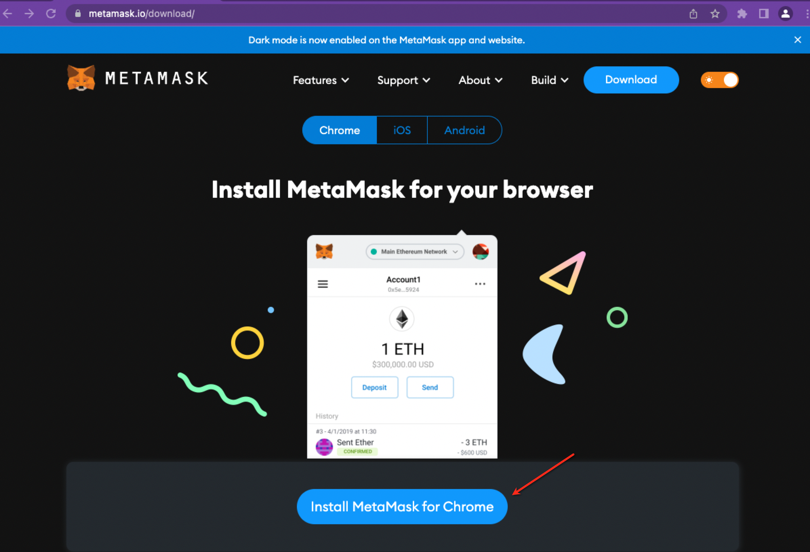

# Add Wallet to Golden.com

## Connecting to your Wallet on Golden.com

1\. You can connect to your Wallet from your [Account Settings](https://golden.com/settings/profile) in Golden. If you first need to create a Wallet, please see our detailed instructions [below](https://www.notion.so/Connecting-a-Wallet-to-Golden-com-8cc2addc89f14e8eab4c6d522fada13c).

2\. Click ‘Connect Wallet’ and select MetaMask or WalletConnect.

3\. Enter your MetaMask password (if prompted) after clicking the MetaMask icon or, if using WalletConnect, scan the QR code with a WalletConnect-compatible wallet or search for your preferred Wallet.

4\. Press ‘Sign’ on the signature request window.

5\. The Wallet field in Accounts Setting will show that your Wallet is connected.

## Other Ways to Connect to your Wallet on Golden.com

You can also connect to your Wallet on [Golden.com](http://golden.com) when you first sign up for a Golden account or when you edit the Golden Knowledge Graph for the first time.

1\. [Signing up](https://golden.com/signup) for a Golden.com account - after entering your Name, Email and Password, continue to Account Setup to connect your Wallet via [Steps 1 through 5 above](https://www.notion.so/Connecting-a-Wallet-to-Golden-com-8cc2addc89f14e8eab4c6d522fada13c).

.png)

2\. Editing the Golden Knowledge Graph for the First Time - after clicking Edit on a Topic Page, you will first have to connect to your Wallet to make any changes in prose or Infobox fields on a Topic Page. The steps to connect to your Wallet follow [Steps 1 through 5 above](https://www.notion.so/Connecting-a-Wallet-to-Golden-com-8cc2addc89f14e8eab4c6d522fada13c).

## How to Create a Wallet

1\. We recommend creating a Wallet via MetaMask. Visit the official MetaMask website [here](https://metamask.io/) and click ‘Download Now’. Next, click ‘install MetaMask’ to download the MetaMask Wallet software onto your browser.\
MetaMask is compatible with the following browsers: Google Chrome, Firefox, Brave or Edge.\
Note: MetaMask is not compatible with Safari. If you are using Safari, we recommend creating a Wallet with [Rainbow](https://rainbow.me/) and connecting to your wallet on Golden using WalletConnect.

2\. Once you’ve successfully downloaded the MetaMask extension, navigate to your browser’s extension menu in the top right corner of your browser, and click on the MetaMask extension icon.

3\. Click the “Get Started” button and you’ll be presented with two options. Click ‘Create a Wallet.”

4\. Next, select “I Agree” to a short disclaimer that appears and create your password. You will need to enter your password each time you wish to access your MetaMask Wallet.

5\. Next, reveal your Secret Recovery Phrase. In short, your Secret Recovery Phrase consists of 12 random words. Your Secret Recovery Phrase acts as a backup in case you lose the device where your MetaMask Wallet is downloaded and you need to import it to a new device.\
Carefully copy down each word in the order they are presented on the screen. The order of the words is crucial as you won’t be able to import your account to a new device if the words are in the wrong order. Don't share your seed phrase with anyone as it gives the access to your wallet.\
MetaMask will prompt you to select and place each phrase in the correct order before you can continue to the next step.

\
6\. Congratulations! You have successfully completed your MetaMask Wallet setup. If you ever need to sign into your wallet, click the MetaMask icon in your browser’s extension menu and enter your password.

### Next: [Structured Data Writing Guide](https://www.notion.so/Structured-Data-Writing-Guide-ae657337bf4f4e54ae4402df083c76ac)
