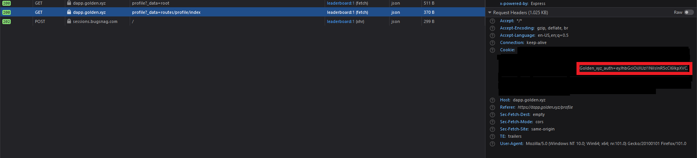

# Authentication

Some queries and mutations will require authentication given your user account and wallet address. Currently, the easiest way to obtain your authentication token is manually through the browser. Note: When using the Python SDK you may retrieve your token programmatically.&#x20;

## Manually with Browser

1. Log in at[ dapp.golden.xyz](https://dapp.golden.xyz) by connecting your wallet.
2. Inspect your browser (cmd+option+i or F12) and refresh the page.
3. Go to the `network` tab in the inspector.
4. Look for any calls reaching hitting `dapp.golden.xyz` endpoints and click on it
5. Check out the request headers and find the "Cookie" key.
6. Copy the bearer token that follows after `Golden_xyz_auth=...` and paste it into the GraphiQL console request headers at the bottom.  Example headers: `{ "Authorization": "Bearer <your-token-here>" }`

