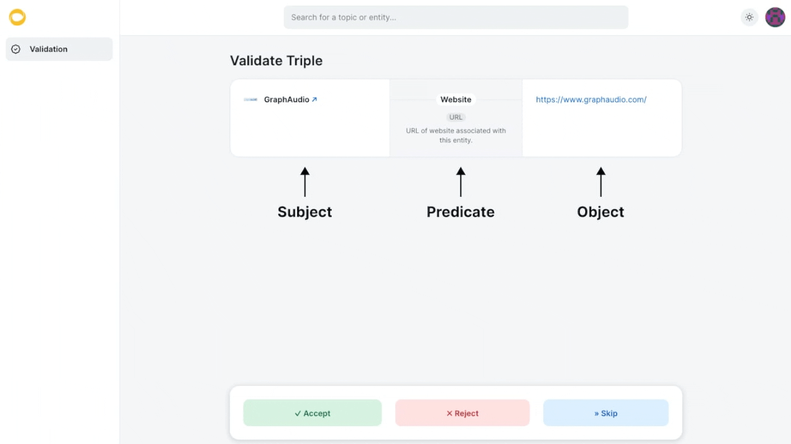

# Triple Verification Guide

[Triples](../concepts/triple.md) that are submitted to Golden need to be checked by others to form a consensus on whether a ‘fact’ triple should be included in the knowledge graph or not. The dApp triple [verification](../concepts/verification.md) page allows verifiers to confirm that the triple is true by voting ‘accept’, ‘reject’, or to skip over the vote. In the verification queue, your task is to decide if the URL shown is the entity’s primary or official URL for this predicate. ​Please use caution before clicking on a URL. You can skip over URLs that you do not trust.

Users that execute verifications that form a consensus above a threshold whereby the triple becomes accepted by the protocol, will receive a future reward which will be airdropped upon the token launch. ​(If you haven’t already, you should read the [Golden Protocol FAQ](<../../README (2).md>) before continuing this guide and starting to verify. This document explains what a triple is and how the protocol will operate at a high level.​)

To become eligible to view the dApp and the verification queue, you must [connect a wallet on Golden.com](https://goldenhq.notion.site/Connecting-a-Wallet-to-Golden-com-8cc2addc89f14e8eab4c6d522fada13c) and [submit at least one triple](https://goldenhq.notion.site/Adding-Structured-Data-Guide-ae657337bf4f4e54ae4402df083c76ac). You will be emailed when your account has been approved for dApp access. Please note, this process may take up to one week.&#x20;

**Directions**

The verification queue displays one unverified triple at a time. Your task is to look at the relationship and judge if the information displayed is true or false. If the triple is true, click the ‘Accept’ button. If the triple is false, click the ‘Reject’ button. If you are not sure, you may click the ‘Skip’ button. You will be penalized for selecting the wrong answer (explained below) and rewarded for being correct.​

You are encouraged to use any resources you have available in order to verify triples with confidence. The primary evidence you have to go on is the information in the URL or citation presented.​

<figure><figcaption>
Example of the "verification" process
</figcaption></figure>

**Penalties and rewards**

Golden has prestaked testnet points to wallets with a certain number of testnet points to get started.​ These testnet points will be used to calculate future eligible airdrops.

Correct verifications, those that agree with the consensus verification vote on the triple, will be rewarded with testnet points.​

Verifiers submitting incorrect verifications, those that do not agree with the consensus verification vote on a triple, will be penalized by losing a portion of their testnet points. In extreme cases, verifiers may lose all of their testnet points and/or their access to dApp.​

**Skipping a task**

Verifiers can ‘skip’ tasks that they find ambiguous or would prefer to not verify. Initially, your "Skips" are limited but increase with more accept or reject actions you take. ​

**Non-English content**

URLs that point to sites with majority non-English content should be rejected for now. Social platform URLs with just an entity name/description not based on the Latin alphabet may still be accepted if the entity can be clearly associated with its Latin-based name represented in the protocol. Users that have added majority non-English will not be penalized, but they will not have their triples accepted in the near future.​

Later, we will revote on these URL triples with majority non-English content with proper support in the graph to handle it.

**Broken, redirected or non-loading URLs**

<figure><figcaption></figcaption></figure>

If you come across a broken URL that doesn’t load such as a website URL that results in a 404 error, or a broken Facebook URL, you should reject the URL.

For URL redirect cases, if the redirect gets to the canonical URL, this is currently sufficient to accept. For example:

* If ‘[Tim Cook](https://golden.com/wiki/Tim\_Cook-N9YN83)’ → ‘website’ → ‘[timcook.com](http://timcook.com/)’ is submitted and [timcook.com](http://timcook.com/) redirects to [www.apple.com/leadership/tim-cook/](https://www.apple.com/leadership/tim-cook/), the original triple should be accepted​
* If ‘[Tim Cook](https://golden.com/wiki/Tim\_Cook-N9YN83)’ → ‘website’ → ‘[timcook.com](http://timcook.com/)’ is submitted and [timcook.com](http://timcook.com/) redirects to [markzuckerberg.com](https://markzuckerberg.com/), the triple should be rejected as the redirected URL is not the direct website for [Tim Cook​](https://golden.com/wiki/Tim\_Cook-N9YN83)

In cases that are vague, it may make sense to skip.

**Common misuse of URL predicates**

**Website**: The 'website' predicate should be reserved for URLs that represent a website directly associated with the entity. '[Tim Cook](https://golden.com/wiki/Tim\_Cook-N9YN83)' --> 'website' --> '[Apple.com](https://www.apple.com/)' would not be valid, as while Apple CEO is Tim Cook, '[Apple.com'](https://www.apple.com/) is not a website directly associated with Tim Cook. [www.apple.com/leadership/tim-cook/](https://www.apple.com/leadership/tim-cook/), however, would be.  A social URL submitted for the website predicate (i.e., Facebook, Twitter, YouTube) should not be accepted as a 'website' predicate at this time.  These will later be migrated to their respective infobox fields.

**Shortened URLs**: URLs that are submitted as a shortened form of a canonical URL should be rejected.  Only the most official, non-redirected variant of a URL should be accepted if multiple are available.  For example, if '[YouTube](https://golden.com/wiki/YouTube-AZENJ4)' --> 'website' --> '[youtu.be](https://www.youtube.com/)' is submitted, it should be rejected.  The most official URL for this domain is '[youtube.com](https://www.youtube.com/)'.  Other examples of shortened URLs include [bit.ly](https://bitly.com/), [goo.gl](https://developers.googleblog.com/2018/03/transitioning-google-url-shortener.html), [amzn.to](https://www.amazon.com/), and [t.co](https://t.co/).

**Social URLs** (Facebook, Twitter, LinkedIn, etc.): Products rarely have social URLs, but the parent company of the product often does.  For example, ‘[www.linkedin.com/company/amazon/](https://www.linkedin.com/company/amazon/)’ is an appropriate LinkedIn URL for the company ‘[Amazon](https://golden.com/wiki/Amazon\_\(company\)-B6VEMY)’, but it would not be appropriate for [Amazon’s Kindle product](https://golden.com/wiki/Amazon\_Kindle-9Y949M). If a more specific URL of the subject exists for the entity, that should be used instead of a broader one. &#x20;

* Social URLs should be official and not parody accounts.  A Facebook URL for [Tim Cook](https://golden.com/wiki/Tim\_Cook-N9YN83) that is not created by an account Tim Cook is associated with should be rejected.&#x20;
* A YouTube video about the entity should be rejected.

Questions and suggestions should be routed to our [community Discord](https://discord.com/invite/28QcktsGmG).&#x20;

